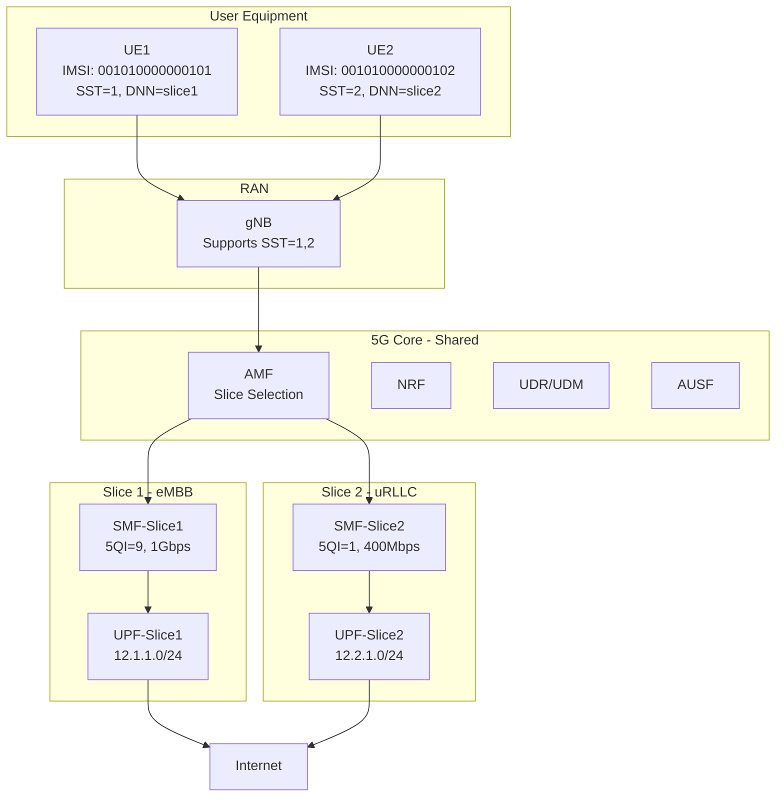
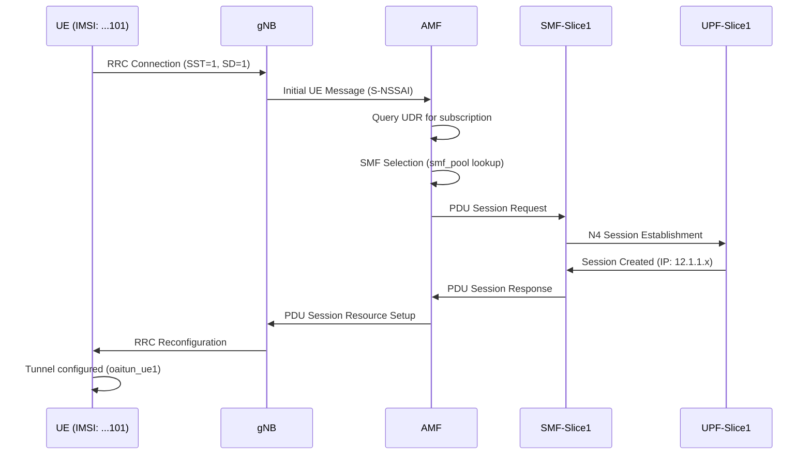

# 5G Network Slicing Architecture Walkthrough

This document explains how network slicing is implemented in your OAI-based 5G deployment.

## Architecture Overview



---

## Slice Configuration Summary

| Parameter | Slice 1 (eMBB) | Slice 2 (uRLLC) |
|-----------|----------------|-----------------|
| **SST** | 1 | 2 |
| **SD** | 0x000001 | 0x000001 |
| **DNN** | slice1 | slice2 |
| **5QI** | 9 (default data) | 1 (conversational voice) |
| **Session AMBR DL** | 1000 Mbps | 400 Mbps |
| **Session AMBR UL** | 500 Mbps | 200 Mbps |
| **IP Pool** | 12.1.1.0/24 | 12.2.1.0/24 |
| **SMF** | oai-smf-slice1 | oai-smf-slice2 |
| **UPF** | oai-upf-slice1 | oai-upf-slice2 |

---

## How Slicing is Implemented

### 1. gNB Configuration

The gNB advertises support for multiple slices via `snssaiList`:

```yaml
# File: bp-flexric-slicing/oai-gnb/values.yaml
config:
  snssaiList:
    - sst: 1     # Slice 1: eMBB
      sd: 0x1
    - sst: 2     # Slice 2: uRLLC
      sd: 0x1
```

### 2. AMF - Slice Selection (Core Logic)

The AMF maintains a **SMF pool** that maps S-NSSAIs to specific SMFs:

```yaml
# File: bp-flexric-slicing/oai-5g-core/oai-amf/config.yaml

snssais:
  - &slice1
    sst: 1
    sd: 000001
  - &slice2
    sst: 2
    sd: 000001

amf:
  enable_smf_selection: yes
  
  # SMF pool maps slices to SMFs
  smf_pool:
    - host: oai-smf-slice1
      snssai:
        - *slice1    # SST=1 → SMF-Slice1
    - host: oai-smf-slice2
      snssai:
        - *slice2    # SST=2 → SMF-Slice2
```

### 3. SMF Configuration (QoS Profiles)

Each SMF serves one slice and defines its QoS parameters:

**SMF Slice 1 (eMBB):**
```yaml
# File: bp-flexric-slicing/oai-5g-core/oai-smf-slice1/config.yaml

snssais:
  - &slice1
    sst: 1
    sd: 000001

smf:
  upfs:
    - host: oai-upf-slice1  # Dedicated UPF
  
  local_subscription_infos:
    - single_nssai: *slice1
      dnn: "slice1"
      qos_profile:
        5qi: 9              # Default for web browsing
        session_ambr_ul: "500Mbps"
        session_ambr_dl: "1000Mbps"

dnns:
  - dnn: "slice1"
    ipv4_subnet: "12.1.1.0/24"
```

**SMF Slice 2 (uRLLC):**
```yaml
# File: bp-flexric-slicing/oai-5g-core/oai-smf-slice2/config.yaml

snssais:
  - &slice2
    sst: 2
    sd: 000001

smf:
  upfs:
    - host: oai-upf-slice2  # Dedicated UPF
  
  local_subscription_infos:
    - single_nssai: *slice2
      dnn: "slice2"
      qos_profile:
        5qi: 1              # Conversational voice (lowest latency)
        session_ambr_ul: "200Mbps"
        session_ambr_dl: "400Mbps"

dnns:
  - dnn: "slice2"
    ipv4_subnet: "12.2.1.0/24"
```

### 4. UPF Configuration (Traffic Isolation)

Each UPF handles traffic for one slice with separate IP pools:

```yaml
# File: bp-flexric-slicing/oai-5g-core/oai-upf-slice1/config.yaml
snssais:
  - sst: 1
    sd: 000001
upf_info:
  sNssaiUpfInfoList:
    - sNssai: *slice1
      dnnUpfInfoList:
        - dnn: slice1
dnns:
  - dnn: "slice1"
    ipv4_subnet: "12.1.1.0/24"  # Slice 1 IP pool
```

### 5. UE Configuration (Slice Selection)

UEs request specific slices via IMSI, DNN, and S-NSSAI:

**UE1 (values.yaml):**
```yaml
config:
  fullImsi: "001010000000101"
  dnn: "slice1"
  sst: 1
  sd: 1
```

**UE2 (values.yaml):**
```yaml
config:
  fullImsi: "001010000000102"
  dnn: "slice2"
  sst: 2
  sd: 1
```

### 6. Database Subscription (UDR)

The database maps each IMSI to its allowed slice:

```sql
-- SessionManagementSubscriptionData
INSERT INTO SessionManagementSubscriptionData VALUES 
('001010000000101', '00101', '{"sst": 1, "sd": "1"}', 
 '{"slice1":{...,"5gQosProfile":{"5qi":9},...}}');

INSERT INTO SessionManagementSubscriptionData VALUES 
('001010000000102', '00101', '{"sst": 2, "sd": "1"}', 
 '{"slice2":{...,"5gQosProfile":{"5qi":1},...}}');
```

---

## UE Slice Join Flow



---

## QoS and 5QI Explained

| 5QI | Type | Latency | Use Case |
|-----|------|---------|----------|
| **1** | GBR | 100ms | Conversational Voice |
| **9** | Non-GBR | 300ms | Default (web, video) |

> **Your Setup:** Slice 2 uses 5QI=1 for lower latency priority, Slice 1 uses 5QI=9 for best-effort high-throughput.

---

## Testing Slicing Performance

### Verify Connectivity
```bash
./bp-flexric-slicing/start_slicing.sh verify
```

### Run Slicing Tests
```bash
./bp-flexric-slicing/start_slicing.sh test
```

### Run Performance Benchmark
```bash
./bp-flexric-slicing/start_slicing.sh benchmark
```

This tests:
- **Latency** - Ping RTT comparison
- **Throughput** - iperf3 UL/DL speeds
- **Fairness** - Slice 2 latency under Slice 1 load

---

## Key Files Reference

| Component | Configuration File |
|-----------|-------------------|
| AMF | [config.yaml](file:///mnt/Studies/Sorbonne/Nova/Network-Slicing-using-OAI-and-OAI-5GC/bp-flexric-slicing/oai-5g-core/oai-amf/config.yaml) |
| SMF Slice 1 | [config.yaml](file:///mnt/Studies/Sorbonne/Nova/Network-Slicing-using-OAI-and-OAI-5GC/bp-flexric-slicing/oai-5g-core/oai-smf-slice1/config.yaml) |
| SMF Slice 2 | [config.yaml](file:///mnt/Studies/Sorbonne/Nova/Network-Slicing-using-OAI-and-OAI-5GC/bp-flexric-slicing/oai-5g-core/oai-smf-slice2/config.yaml) |
| UPF Slice 1 | [config.yaml](file:///mnt/Studies/Sorbonne/Nova/Network-Slicing-using-OAI-and-OAI-5GC/bp-flexric-slicing/oai-5g-core/oai-upf-slice1/config.yaml) |
| UPF Slice 2 | [config.yaml](file:///mnt/Studies/Sorbonne/Nova/Network-Slicing-using-OAI-and-OAI-5GC/bp-flexric-slicing/oai-5g-core/oai-upf-slice2/config.yaml) |
| gNB | [values.yaml](file:///mnt/Studies/Sorbonne/Nova/Network-Slicing-using-OAI-and-OAI-5GC/bp-flexric-slicing/oai-gnb/values.yaml) |
| UE Slice 1 | [values.yaml](file:///mnt/Studies/Sorbonne/Nova/Network-Slicing-using-OAI-and-OAI-5GC/bp-flexric-slicing/oai-nr-ue-slice1/values.yaml) |
| UE Slice 2 | [values.yaml](file:///mnt/Studies/Sorbonne/Nova/Network-Slicing-using-OAI-and-OAI-5GC/bp-flexric-slicing/oai-nr-ue-slice2/values.yaml) |
| Deployment Script | [start_slicing.sh](file:///mnt/Studies/Sorbonne/Nova/Network-Slicing-using-OAI-and-OAI-5GC/bp-flexric-slicing/start_slicing.sh) |
